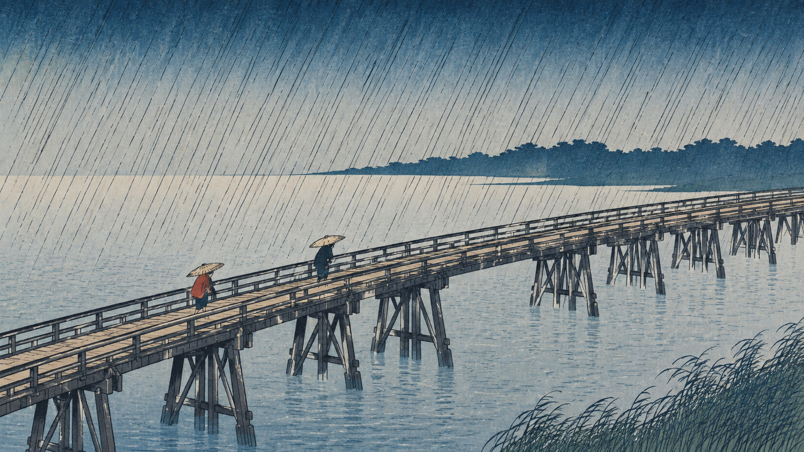
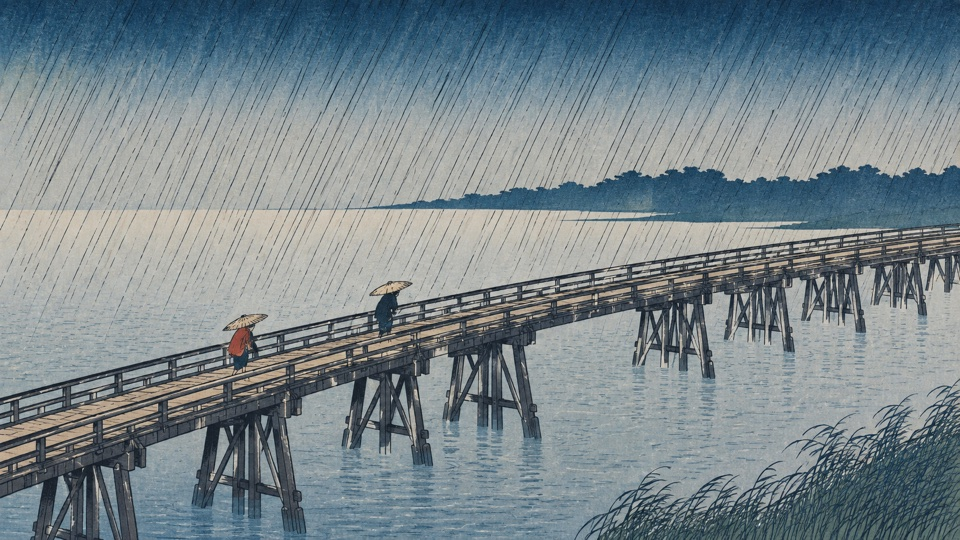
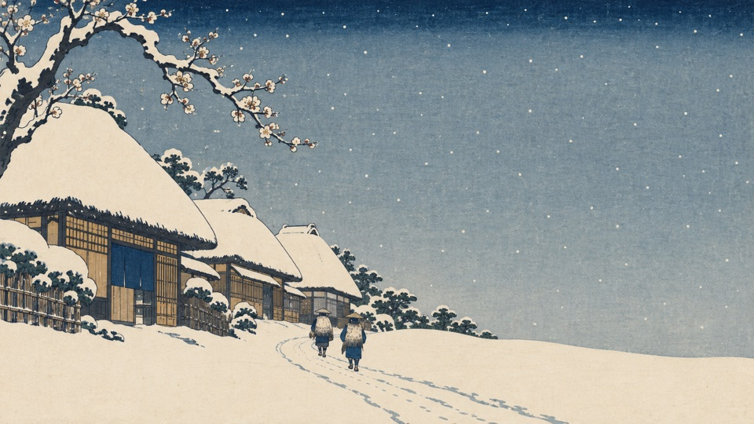
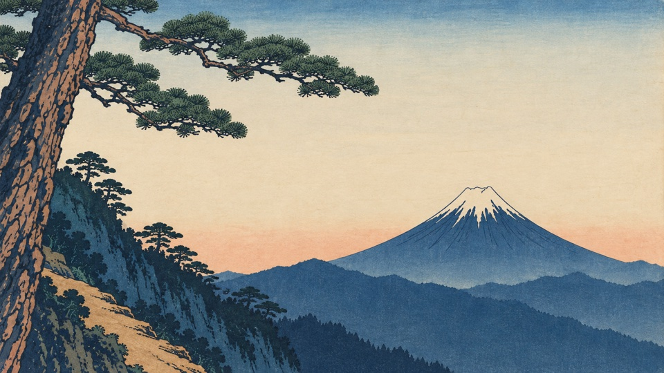
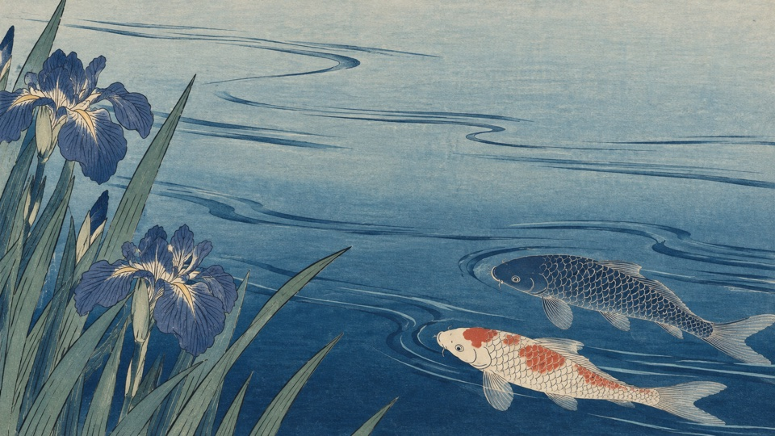
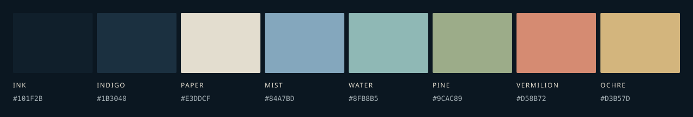

# Shigure / 時雨

**四つの静かな風景を、ひとつの藍色のデスクトップに。**

[English](README.md) · 日本語 · [简体中文](README.zh-CN.md)



**Omarchy 4.0** 向けのダークテーマ。墨を思わせる藍色の背景に、生成りの文字、
青灰色のフォーカス枠、控えめな朱色を組み合わせました。
**雨・雪・山・水**。異なる四つの風景が、落ち着いた作業空間をつくります。

## 風景の中で、仕事をする

Shigure の着想源は、**歌川広重の浮世絵**です。繊細な墨の輪郭線、平面的な色面、
ぼかし摺り、紙の白を生かした雪の表現で、木版画らしさを大切にしています。
大胆な横長の構図と広い余白によって、その表現を現代のデスクトップに取り入れました。

着想の中心は、斜めに走る雨、画面の端で切り取られた近景、重なる遠景、
そして墨と紙の余白の関係です。広重の
[「大はしあたけの夕立」](https://www.metmuseum.org/art/collection/search/55433)
は、その背景を知るための参考作品です。ここに収録した壁紙は新たに生成した
現代的な解釈であり、原画のスキャンや複製、広重本人の作品ではありません。

朱色は、小さな句読点のように。藍色が画面の骨格をつくり、温かみのある文字色が
長い作業時間を支えます。

## インストール

**Omarchy 4.0.x** で、このリポジトリの公開後に実行してください。

```bash
omarchy theme install https://github.com/yonglun/omarchy-shigure-theme
```

インストーラーが `shigure` という名前を設定し、テーマを適用します。
再度選択する場合や、次の壁紙に切り替える場合は次のコマンドを使います。

```bash
omarchy theme set shigure
omarchy theme bg next
```

**公開前にダウンロードしたフォルダーから使う場合：** そのフォルダー内で、
以下を実行します。既存の `shigure` がある場合は先にバックアップしてください。
同名ファイルは上書きされます。

```bash
mkdir -p ~/.config/omarchy/themes/shigure/backgrounds
cp colors.toml icons.theme preview.png ~/.config/omarchy/themes/shigure/
cp backgrounds/*.png ~/.config/omarchy/themes/shigure/backgrounds/
omarchy theme set shigure
```

初回適用時は、ファイル名順で **Rain（雨）** が最初に選ばれます。
以降の選択動作は Omarchy のバージョンに従います。冒頭の画像は壁紙のプレビューで、
実際のデスクトップのスクリーンショットではありません。

## 四つの風景

| Rain · 雨 | Snow · 雪 |
|:---:|:---:|
| [](backgrounds/01-rain.png) | [](backgrounds/02-snow.png) |
| 斜めに架かる木橋、傘を差す二人の旅人、細い雨の線。 | 雪をかぶった宿場の家々、梅の枝、白い道を歩く旅人。 |

| Mountain · 山 | Water · 水 |
|:---:|:---:|
| [](backgrounds/03-mountain.png) | [](backgrounds/04-water.png) |
| 大きく切り取った松の向こうに、青い山裾と富士を望む。 | 広い水面に流れる線と、菖蒲の花、二匹の鯉。 |

画像をクリックするとフルサイズの壁紙が開きます。すべて文字なしの
**4096 × 2304 PNG、16:9、sRGB**。四枚とも異なる題材と構図で、舟は登場しません。
共通のパレットを使うため、壁紙を替えてもデスクトップ全体の統一感が保たれます。

生成時の元画像は **1672 × 941** で、配布用にリサンプリングしています。
4K クラスの画像寸法ですが、ネイティブ 4K 生成の細部を持つ画像ではありません。

## 配色



| 役割 | 色 | 用途 |
|---|---|---|
| 墨藍 | `#101F2B` | メイン背景 |
| 浅い藍 | `#1B3040` | 補助サーフェス |
| 生成り | `#E3DDCF` | 本文 |
| 雪 | `#F3EFE6` | カーソル、明るい文字 |
| 青灰 | `#84A7BD` | 青系の構文色、フォーカス枠 |
| 水緑 | `#8FB8B5` | シアン系の構文色、グラデーション終点 |
| 松葉 | `#9CAC89` | 緑系の構文色 |
| 朱 | `#D58B72` | 選択中の項目、UI アクセント |
| 黄土 | `#D3B57D` | 黄色系の構文色 |

これらは Shigure 独自の色で、歴史的な顔料の標準色を示すものではありません。
本文と背景のコントラスト比は **12.38:1**、基本の八つの有彩色はすべて
同じ背景に対して **5.9:1 超**、選択中の文字は **7.75:1** です。
不透明な指定色どうしの測定値であり、全アプリの表示を保証する値ではありません。

## Omarchy との互換性

[`colors.toml`](colors.toml) にセマンティックパレット、明示的な `mode = "dark"`、
明るい色群、対応する寒色の枠グラデーションを定義しています。端末、エディター、
Hyprland、シェルの設定は Omarchy 自身のテンプレートから生成されます。
`icons.theme` は公式ドキュメントにある `Yaru-prussiangreen` を指定しています。
実行可能なテーマフックやアプリごとの設定上書きは含みません。

互換性は **v4.0.0** の色リゾルバーとテンプレートに基づいて確認しています。
[検証内容と制限](docs/COMPATIBILITY.md)を参照してください。この macOS 作業環境では、
実際の Omarchy デスクトップへのインストール確認は行っていません。

## 作品と利用

本コレクションは、歌川広重の浮世絵に着想を得ています。
[制作記録](docs/ARTWORK.md)に画像の制作方法と処理内容を掲載しています。
Shigure はコミュニティによるテーマで、Omarchy の公式テーマではありません。

設定、ドキュメント、収録画像は [MIT ライセンス](LICENSE) で配布します。
スクリーンショットや派生版を公開する際に Shigure へのリンクを添えていただけると、
ほかの方が見つけやすくなります。

紹介文の例：*雨・雪・山・水。歌川広重の浮世絵に着想を得た、静かな藍色の Omarchy テーマ。*

推奨トピック：`omarchy-theme`、`omarchy`、`hiroshige`、`ukiyo-e`、`dark-theme`、
`wallpaper`、`indigo`。
