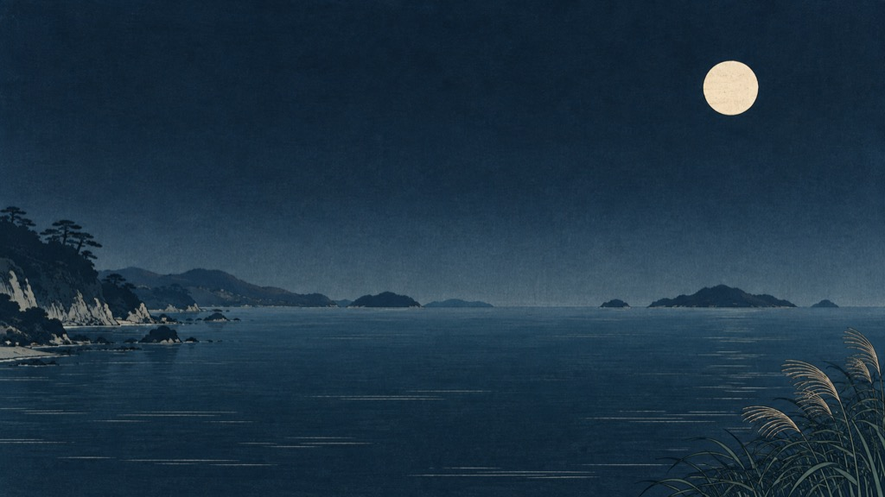
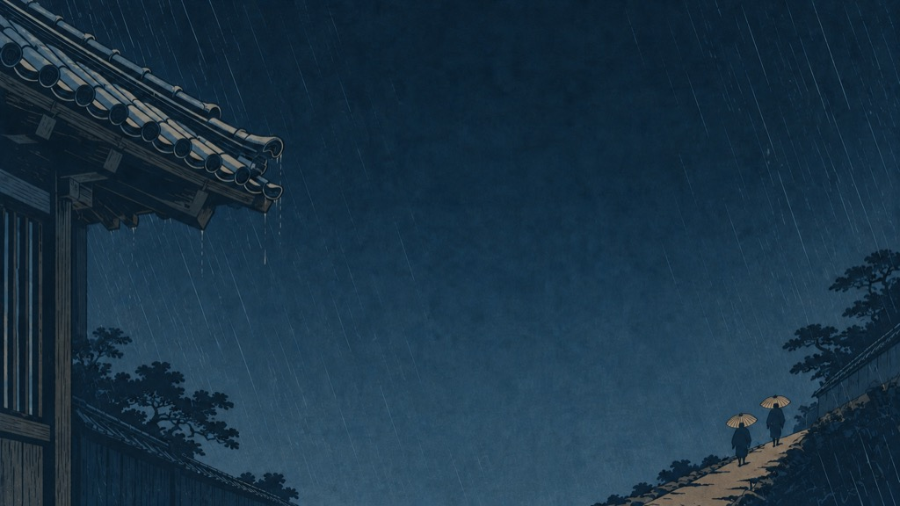
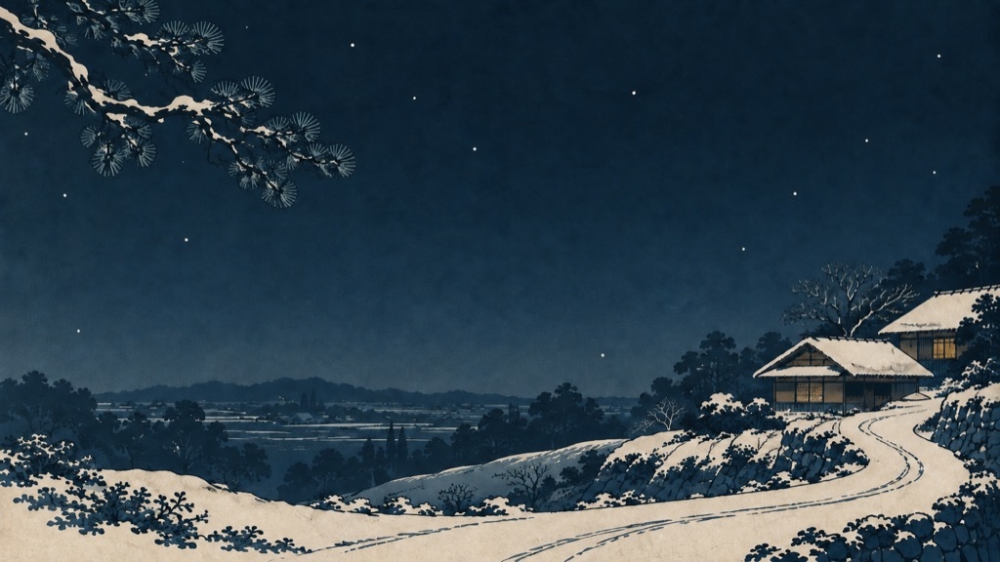
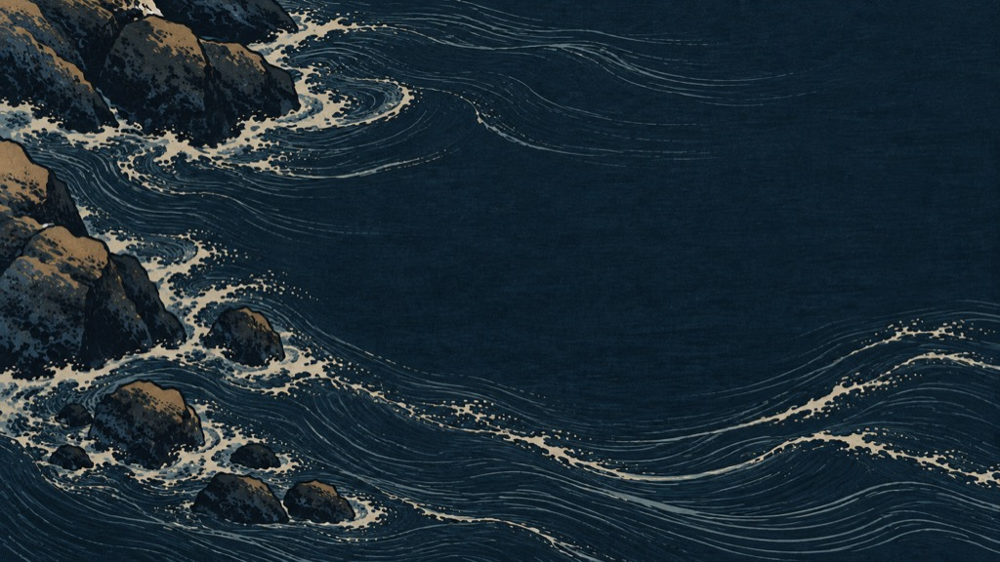

# Shigure II · 月下

**月、雨、雪、潮，一张月色中的静谧藍色桌面。**

[English](README.md) · [日本語](README.ja.md) · 简体中文


为 **Omarchy 4.0** 设计的深色主题：墨藍底色、暖纸文字、旧金交互强调、月白光标，
以及从旧金到雾蓝的焦点边框。**月、雨、雪、潮**，四幅不同构图共同构成安静的工作空间。
默认壁纸为月。

## 在风景中工作

Shigure II 的设计灵感来自**歌川广重的浮世绘**：细密的墨线轮廓、平涂套色、渐层晕染，
以及墨色与纸面留白的关系。不对称的宽幅构图和充分的留白，让这种绘画语言融入现代桌面。

广重的 [Eight Views of Kanazawa at Night](https://www.clevelandart.org/art/1924.967)
提供了月色、低岸与横向层次的历史参考。系列发展出四种独立构图：远景月湾、雨中双伞、
无人的雪路，以及俯视潮水。旧金标记交互，藍色组织桌面。

## 安装

目前是 **Shigure II 本地候选**。在下载或解压后的主题目录中，按以下命令安装到
**Omarchy 4.0.x** 的新目录 `shigure-ii`，可与第一版 `shigure` 并存。
如果已有 `shigure-ii`，复制前请先备份；同名文件会被替换。

```bash
mkdir -p ~/.config/omarchy/themes/shigure-ii/backgrounds
cp colors.toml icons.theme preview.png ~/.config/omarchy/themes/shigure-ii/
cp backgrounds/*.png ~/.config/omarchy/themes/shigure-ii/backgrounds/
omarchy theme set shigure-ii
```

需要时可切换下一张壁纸（按月 → 雨 → 雪 → 潮循环）：

```bash
omarchy theme bg next
```

首次应用时，按文件名排序从 **Moon／月** 开始。后续壁纸选择行为由 Omarchy 版本决定。
页首图片是 **1600 × 900 的壁纸展示副本**，并非真实桌面截图。

**待此候选发布到仓库后**，才可通过 URL 安装：

```bash
omarchy theme install https://github.com/yonglun/omarchy-shigure-theme
```

URL 安装器会识别名称 `shigure` 并应用主题。这一路径沿用第一版目录名；
若已有 `shigure`，使用前请先备份。本轮尚未发布候选，也未在真实 Omarchy 会话中安装。

## 四幅风景

| Moon · 月 | Rain · 雨 |
|:---:|:---:|
| [](backgrounds/01-moon.png) | [](backgrounds/02-rain.png) |
| 月轮、远景海湾、低岸与芦苇；中央留出夜空和水面。 | 裁切的屋檐、斜雨与双伞行人；暖色集中在伞和道路。 |

| Snow · 雪 | Tide · 潮 |
|:---:|:---:|
| [](backgrounds/03-snow.png) | [](backgrounds/04-tide.png) |
| 无人的雪夜，雪松、屋舍与 S 形雪路。 | 俯视近景礁石与弯曲潮水，全幅没有天空和地平线。 |

点击图片可查看原始壁纸。四张均为无文字的 **1672 × 941 PNG / RGB**，**无嵌入 ICC 配置**。
保留实际生成尺寸，近似 16:9，没有放大或额外调色，不是原生 4K 图像。
图库使用 **1024 × 576 JPEG** 展示副本。四幅共用一套主题配色。

## 配色


| 角色 | 色值 | 用途 |
|---|---|---|
| 墨藍 | `#101F2B` | 主背景 |
| 浅藍 | `#1B3040` | 次级表面 |
| 暖纸 | `#E3DDCF` | 正文 |
| 月白 | `#F0E7D5` | 光标与高亮文字 |
| 旧金 | `#CBB98B` | 选中控件、交互强调与焦点渐变起点 |
| 雾蓝 | `#84A7BD` | 蓝色语法与焦点渐变终点 |
| 水绿 | `#8FB8B5` | 青色语法 |
| 松叶 | `#9CAC89` | 绿色语法 |
| 朱色 | `#CE887D` | 红色语义 |
| 赭黄 | `#D3B57D` | 黄色语法 |

焦点边框为 `rgba(CBB98Bee) rgba(84A7BDee) 45deg`。相对第一版，仅调整 `accent`、
`bright_foreground`、`hyprland_active_border`，其余语义色保持原值。
这些是专属色值，不代表历史颜料的标准色。

正文与主背景对比度为 **12.38:1**，选区文字为 **7.24:1**。
旧金与主背景、次级表面的对比度分别为 **8.66:1**、**7.03:1**。
这些是指定不透明颜色对的测量结果，不代表所有应用最终显示效果。

## Omarchy 兼容性

[`colors.toml`](colors.toml) 提供语义配色、明确的 `mode = "dark"`、亮色组及受支持的焦点渐变。
终端、编辑器、Hyprland 与 Shell 配置由 Omarchy 自带模板生成。
[`icons.theme`](icons.theme) 使用 `Yaru-prussiangreen`。主题不包含可执行钩子，也不覆盖应用配置。

验证以官方 **v4.0.0** 为目标，详见[覆盖范围与限制](docs/COMPATIBILITY.md)和
[验证记录](docs/VALIDATION.json)。当前工作环境为 macOS，尚未在真实 Omarchy 桌面上完成安装验证。

## 来源与使用

本系列以歌川广重的浮世绘为灵感，是新生成的当代诠释，并非历史版画或扫描件。
技术制作于 2026-10-01 使用 OpenAI 内置 ImageGen；[图像制作记录](docs/ARTWORK.md)
链接完整提示词、修订对照与实际源文件元数据。

Shigure II 是社区主题，与 Omarchy 官方项目相互独立。
第一版保留于 Git 提交 `ceb04250c1e9816c83f909e599e924f12b57467c`。
配置、文档与随附图像均采用 [MIT License](LICENSE)。分享衍生作品时，欢迎附上 Shigure 项目链接。

推荐项目简介：*为 Omarchy 设计的月色藍色主题，以歌川广重的浮世绘为灵感，呈现月、雨、雪、潮。*

推荐 Topics：`omarchy-theme`、`omarchy`、`hiroshige`、`ukiyo-e`、`dark-theme`、`wallpaper`、`indigo`。
